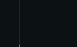
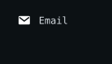
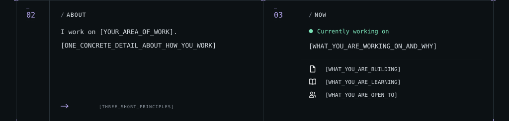
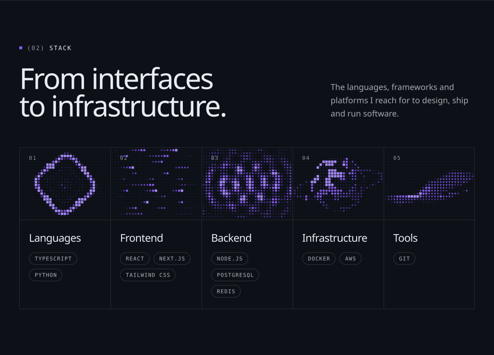
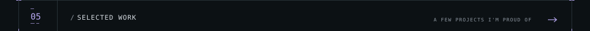
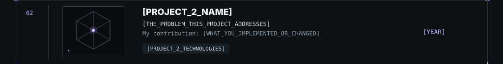
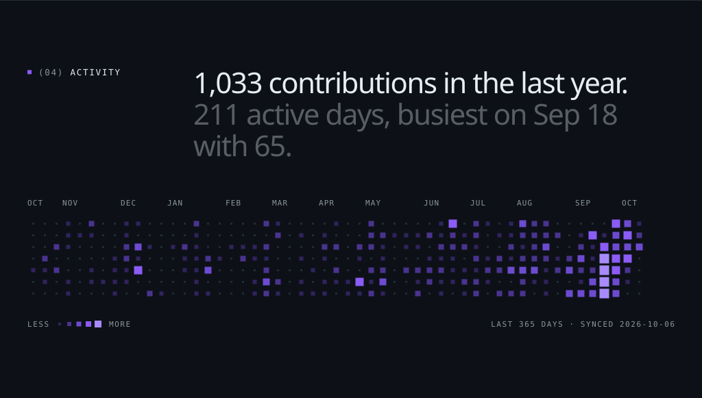

<!-- Generated by tools/profile/update.py. Edit profile.json, then regenerate. -->

<picture><source media="(max-width: 600px)" srcset="./assets/hero-mobile.svg"></picture>
<picture><source media="(max-width: 600px)" srcset="./assets/hero-gutter-mobile.svg"></picture><a href="https://github.com/vjrjunior"><picture><source media="(max-width: 600px)" srcset="./assets/hero-link-1-mobile.svg"></picture></a><a href="https://www.linkedin.com/in/valdeir-junior/"><picture><source media="(max-width: 600px)" srcset="./assets/hero-link-2-mobile.svg"></picture></a><a href="mailto:vjrjunior@gmail.com"><picture><source media="(max-width: 600px)" srcset="./assets/hero-link-3-mobile.svg"></picture></a><picture><source media="(max-width: 600px)" srcset="./assets/hero-art-mobile.svg"></picture>
<picture><source media="(max-width: 600px)" srcset="./assets/about-now-mobile.svg"></picture>
<picture><source media="(max-width: 600px)" srcset="./assets/stack-mobile.svg"></picture>
<picture><source media="(max-width: 600px)" srcset="./assets/work-mobile.svg"></picture>
<picture><source media="(max-width: 600px)" srcset="./assets/work-1-mobile.svg"></picture>
<picture><source media="(max-width: 600px)" srcset="./assets/work-2-mobile.svg"></picture>
<picture><source media="(max-width: 600px)" srcset="./assets/work-3-mobile.svg"></picture>
<picture><source media="(max-width: 600px)" srcset="./assets/activity-mobile.svg"></picture>

