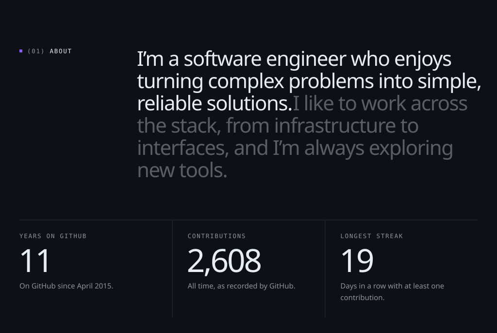
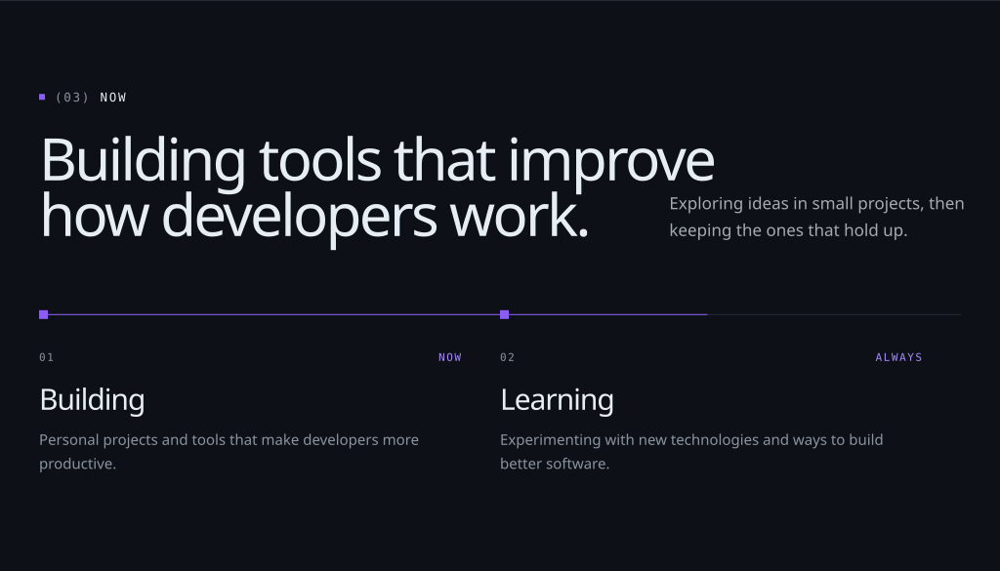
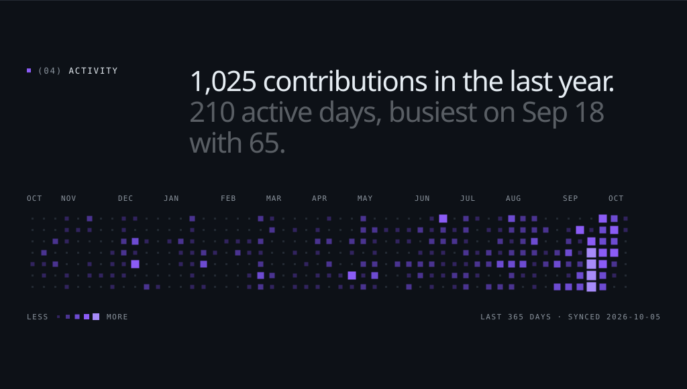
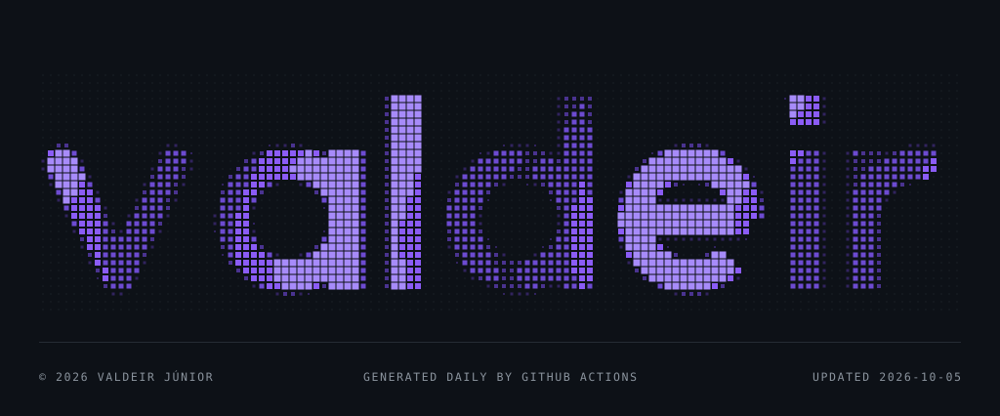

<picture><source media="(max-width: 600px)" srcset="./assets/header-mobile.svg"></picture><a href="mailto:vjrjunior@gmail.com"><picture><source media="(max-width: 600px)" srcset="./assets/header-contact-mobile.svg"></picture></a>
<picture><source media="(max-width: 600px)" srcset="./assets/hero-mobile.svg"></picture>
<picture><source media="(max-width: 600px)" srcset="./assets/hero-start-mobile.svg"></picture><a href="mailto:vjrjunior@gmail.com"><picture><source media="(max-width: 600px)" srcset="./assets/hero-link-1-mobile.svg"></picture></a><a href="https://www.linkedin.com/in/valdeir-junior/"><picture><source media="(max-width: 600px)" srcset="./assets/hero-link-2-mobile.svg"></picture></a><a href="https://github.com/vjrjunior"><picture><source media="(max-width: 600px)" srcset="./assets/hero-link-3-mobile.svg"></picture></a><picture><source media="(max-width: 600px)" srcset="./assets/hero-end-mobile.svg"></picture>
<picture><source media="(max-width: 600px)" srcset="./assets/about-mobile.svg"></picture>
<picture><source media="(max-width: 600px)" srcset="./assets/stack-mobile.svg"></picture>
<picture><source media="(max-width: 600px)" srcset="./assets/now-mobile.svg"></picture>
<picture><source media="(max-width: 600px)" srcset="./assets/activity-mobile.svg"></picture>
<picture><source media="(max-width: 600px)" srcset="./assets/contact-mobile.svg"></picture>
<a href="mailto:vjrjunior@gmail.com"><picture><source media="(max-width: 600px)" srcset="./assets/contact-1-mobile.svg"></picture></a>
<a href="https://www.linkedin.com/in/valdeir-junior/"><picture><source media="(max-width: 600px)" srcset="./assets/contact-2-mobile.svg"></picture></a>
<a href="https://github.com/vjrjunior"><picture><source media="(max-width: 600px)" srcset="./assets/contact-3-mobile.svg"></picture></a>
<picture><source media="(max-width: 600px)" srcset="./assets/footer-mobile.svg"></picture>

